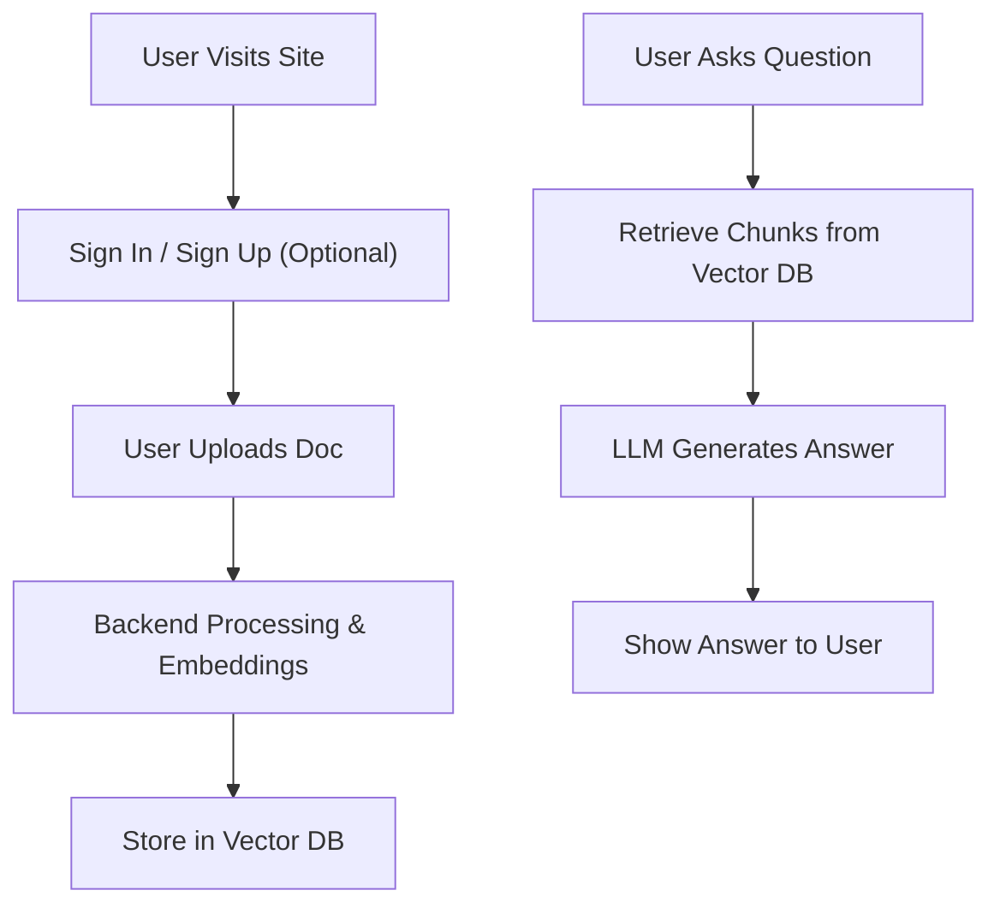

## 1. Product Overview
An intelligent chatbot that answers user questions from uploaded PDFs, DOCX files, CSV files, websites, and custom knowledge bases using Retrieval-Augmented Generation (RAG) and Large Language Models (LLMs).
- Built for modern AI engineering portfolios and recruiter-ready resumes. Demonstrates RAG Architecture, LLM Integration, API Development, and Full Stack deployment.
- Target value: A production-style AI chatbot suitable for a resume portfolio, AI internship, or Full Stack GenAI roles.

## 2. Core Features

### 2.1 User Roles (if applicable)
| Role | Registration Method | Core Permissions |
|------|---------------------|------------------|
| Normal User | No registration required | Upload documents, chat with AI |
| Registered User | Email & Password | Access personalized chat history, save custom API keys securely |

### 2.2 Feature Module
1. **Authentication**: Sign In and Sign Up pages.
2. **Home/Chat Page**: Document upload sidebar, chat interface, chat history.
3. **Settings Modal (optional)**: Select vector DB, configure API keys.

### 2.3 Page Details
| Page Name | Module Name | Feature description |
|-----------|-------------|---------------------|
| Sign In | Auth Form | Login form with email/password, "Forgot Password" link, and link to Sign Up. |
| Sign Up | Auth Form | Registration form with name, email, password, and link to Sign In. |
| Home page | Sidebar | Upload documents (PDF, DOCX, TXT, CSV), list uploaded files. |
| Home page | Chat Interface | Send queries, view AI responses with citations, view conversation history. |

## 3. Core Process
User visits site -> Signs In or Signs Up (Optional) -> User uploads a document -> System processes document -> User asks a question -> System retrieves relevant chunks -> LLM generates an answer -> UI shows answer and citations.

## 4. User Interface Design
### 4.1 Design Style
- **Aesthetic Direction**: High-end modern UI with **Glassmorphism** effects.
- **Primary and secondary colors**: Dark mode base with a mix of vibrant, flowing gradient orbs (purples, pinks, blues, teals) in the background to create a beautiful, colorful backdrop for the frosted glass elements.
- **Glassmorphism**: Semi-transparent backgrounds (`bg-white/10` or `bg-black/20`), background blur (`backdrop-blur-xl`), subtle white/light borders (`border-white/10`), and soft shadows.
- **Button style**: Modern, slightly rounded (rounded-2xl), glowing hover states, fluid transitions.
- **Font and sizes**: Clean sans-serif (Inter or similar).
- **Layout style**: Centered floating glass cards for Auth pages; Sidebar/Main area for chat.
- **Icon/emoji style suggestions**: Minimalist stroke icons (e.g., Lucide).

### 4.2 Page Design Overview
| Page Name | Module Name | UI Elements |
|-----------|-------------|-------------|
| Sign In / Sign Up | Auth Container | Animated colorful gradient background mesh. Central frosted glass card. Minimalist input fields with floating labels or subtle borders. Glowing submit button. |
| Home page | Hero section | Style, Layout, Colors, Fonts, Animation |

### 4.3 Responsiveness
Desktop-first, mobile-adaptive. Sidebar collapses into a hamburger menu on smaller screens. Auth cards resize gracefully for mobile devices.
