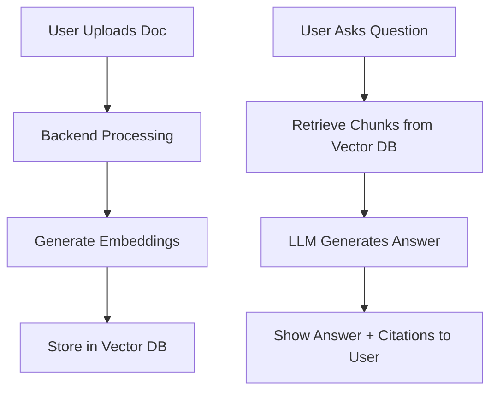

## 1. Product Overview
An intelligent chatbot that answers user questions from uploaded PDFs, DOCX files, websites, and custom knowledge bases using Retrieval-Augmented Generation (RAG) and Large Language Models (LLMs).
- Built for modern AI engineering portfolios and recruiter-ready resumes. Demonstrates RAG Architecture, LLM Integration, API Development, and Full Stack deployment.
- Target value: A production-style AI chatbot suitable for a resume portfolio, AI internship, or Full Stack GenAI roles.

## 2. Core Features

### 2.1 User Roles (if applicable)
| Role | Registration Method | Core Permissions |
|------|---------------------|------------------|
| Normal User | No registration required | Upload documents, chat with AI, view citations |

### 2.2 Feature Module
1. **Home/Chat Page**: Document upload sidebar, chat interface, chat history.
2. **Settings Modal (optional)**: Select vector DB, configure API keys.

### 2.3 Page Details
| Page Name | Module Name | Feature description |
|-----------|-------------|---------------------|
| Home page | Sidebar | Upload documents (PDF, DOCX, TXT), list uploaded files. |
| Home page | Chat Interface | Send queries, view AI responses with citations, view conversation history. |

## 3. Core Process
User uploads a document -> System processes document -> User asks a question -> System retrieves relevant chunks -> LLM generates an answer -> UI shows answer and citations.

## 4. User Interface Design
### 4.1 Design Style
- Primary and secondary colors: Dark mode by default (Slate/Zinc) with an energetic accent color like Indigo or Violet.
- Button style: Modern, slightly rounded (rounded-md), subtle hover states.
- Font and sizes: Clean sans-serif (Inter or similar).
- Layout style: Sidebar for documents/history, main area for chat.
- Icon/emoji style suggestions: Minimalist stroke icons (e.g., Lucide).

### 4.2 Page Design Overview
| Page Name | Module Name | UI Elements |
|-----------|-------------|-------------|
| Home page | Sidebar | File upload dropzone, list of uploaded files, clear context button. |
| Home page | Chat Area | Message bubbles (user vs AI), typing indicator, input field with send button, markdown rendering. |

### 4.3 Responsiveness
Desktop-first, mobile-adaptive. Sidebar collapses into a hamburger menu on smaller screens.
