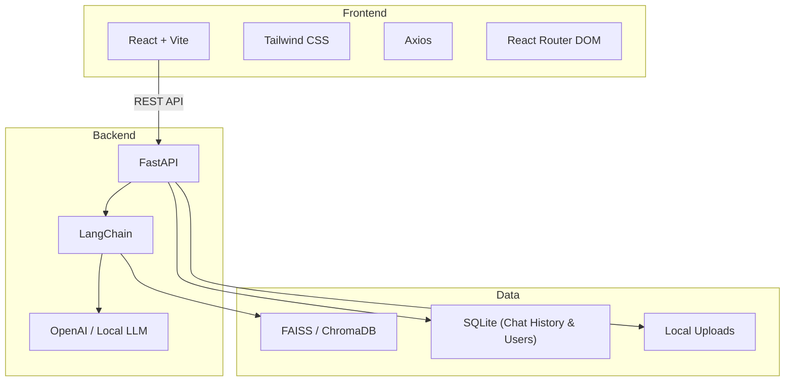
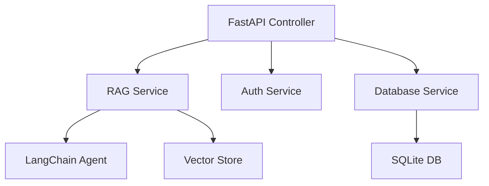
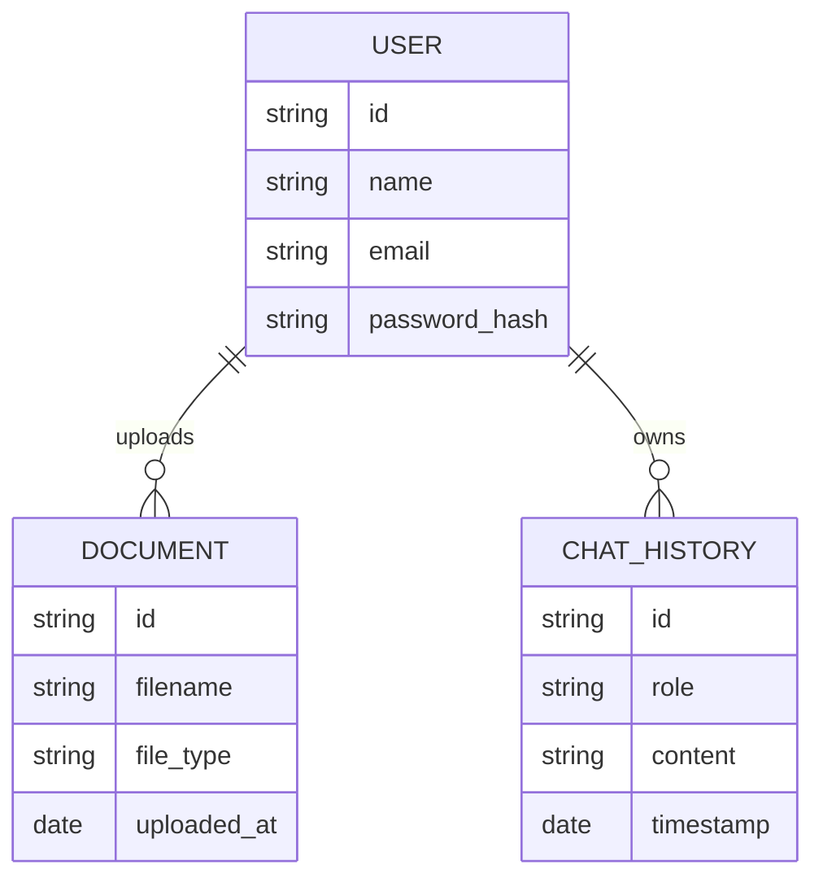

## 1. Architecture Design

## 2. Technology Description
- Frontend: React@18 + react-router-dom + tailwindcss@3 + vite + lucide-react + framer-motion (for glassmorphism animations)
- Backend: Python 3.11+, FastAPI, Uvicorn, LangChain, PyPDF, python-docx, BeautifulSoup4
- Data: FAISS (default), SQLite
- Initialization Tool: vite, pip

## 3. Route Definitions (Frontend)
| Route | Purpose |
|-------|---------|
| /signin | Sign In Page (Glassmorphism design) |
| /signup | Sign Up Page (Glassmorphism design) |
| / | Main Chat & Upload Interface |

## 4. API Definitions
| Endpoint | Method | Purpose |
|----------|--------|---------|
| `/api/upload` | POST | Upload documents (PDF, DOCX, TXT) |
| `/api/chat` | POST | Send a query and get an AI response |
| `/api/history` | GET | Retrieve chat history |
| `/api/auth/login` | POST | Authenticate user (Placeholder/Mock if no backend auth is fully built yet) |
| `/api/auth/register` | POST | Register user (Placeholder/Mock if no backend auth is fully built yet) |

## 5. Server Architecture Diagram

## 6. Data Model (if applicable)
### 6.1 Data Model Definition

