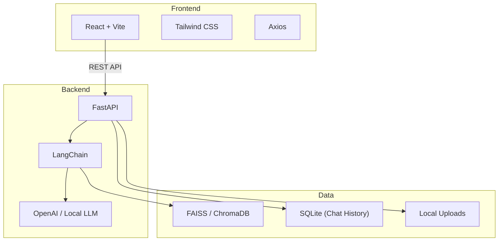
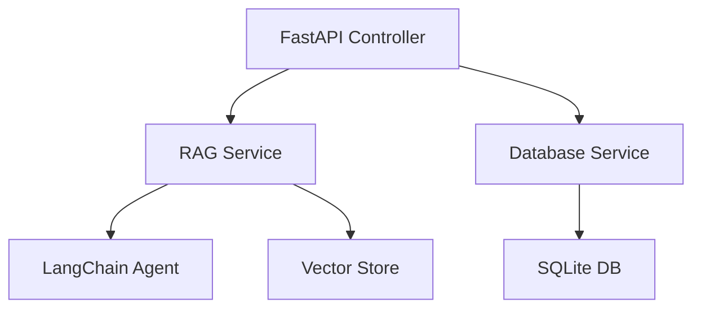
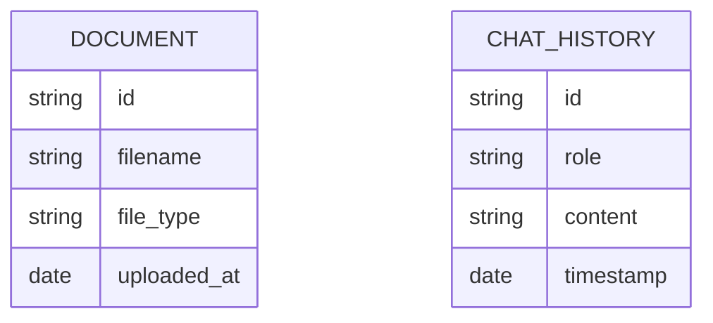

## 1. Architecture Design

## 2. Technology Description
- Frontend: React@18 + tailwindcss@3 + vite
- Backend: Python 3.11+, FastAPI, Uvicorn, LangChain, PyPDF, python-docx, BeautifulSoup4
- Data: FAISS (default), SQLite
- Initialization Tool: vite, pip

## 3. Route Definitions (Frontend)
| Route | Purpose |
|-------|---------|
| / | Main Chat & Upload Interface |

## 4. API Definitions
| Endpoint | Method | Purpose |
|----------|--------|---------|
| `/api/upload` | POST | Upload documents (PDF, DOCX, TXT) |
| `/api/chat` | POST | Send a query and get an AI response |
| `/api/history` | GET | Retrieve chat history |

## 5. Server Architecture Diagram

## 6. Data Model (if applicable)
### 6.1 Data Model Definition

