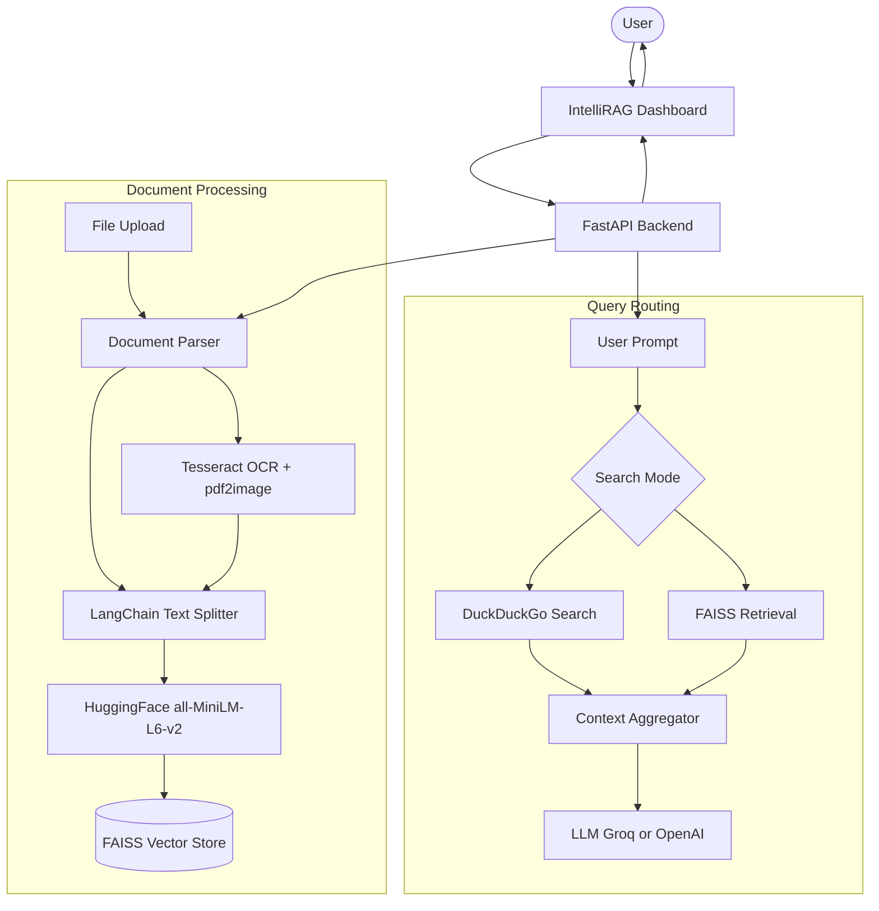
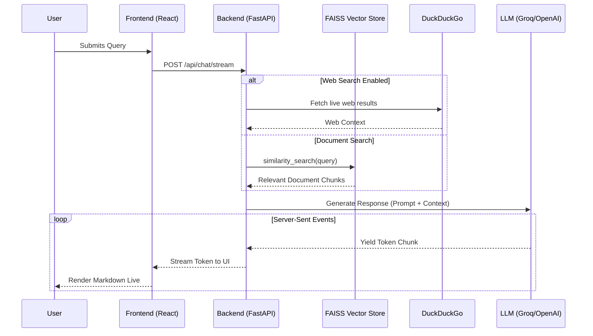

# IntelliRAG

IntelliRAG is a premium, Series-A startup-grade AI document intelligence platform. It allows users to upload complex documents (including scanned PDFs and images), seamlessly chat with their knowledge base, compare document variations, and fall back to real-time web searches wrapped in a highly polished, responsive, glassmorphic UI.

## Features

- **Universal Document Processing:** Upload PDF, DOCX, CSV, TXT, PNG, JPG, and JPEG.
- **Native OCR Engine:** Automatically detects scanned PDFs and images, extracting text using Tesseract OCR.
- **Web Search Fallback:** Bypasses local documents to search the live internet using DuckDuckGo integration.
- **Premium UI/UX:** Deep dark mode, crisp light mode, layered glassmorphism, animated gradients, and fractal noise grain overlays.
- **Document Comparison:** Select two documents and have the AI instantly highlight similarities, differences, and key topics.
- **Real-time Streaming:** Extremely fast Server-Sent Events (SSE) streaming using Groq (Llama-3) or OpenAI.
- **Export & Share:** Native browser-based export to PDF or TXT directly from the chat interface.

---

## Architecture Diagrams

### System Architecture


### Chat Streaming Sequence


---

## Tech Stack

**Frontend:**
- React (Vite)
- Tailwind CSS
- Framer Motion
- Lucide React
- React Markdown

**Backend:**
- FastAPI
- LangChain
- FAISS
- HuggingFace
- Tesseract OCR & Poppler
- SQLite

---

## Getting Started

### Prerequisites
Before you begin, ensure you have the following installed:
- Node.js (v18+)
- Python (3.9+)
- System Dependencies for OCR (macOS):
  ```bash
  brew install tesseract poppler
  ```

### 1. Backend Setup
Navigate to the backend directory, set up your virtual environment, and start the FastAPI server:

```bash
cd backend
python3 -m venv venv
source venv/bin/activate
pip install -r requirements.txt
```

**Environment Variables:**
Create a `.env` file in the `backend/` directory:
```env
GROQ_API_KEY=gsk_your_groq_api_key_here
OPENAI_API_KEY=sk-your_openai_api_key_here
VECTOR_STORE_DIR=./vector_store
UPLOAD_DIR=./uploads
DATABASE_URL=sqlite:///./rag_app.db
```

**Run Backend:**
```bash
uvicorn app.main:app --host 0.0.0.0 --port 8000 --reload
```

### 2. Frontend Setup
Open a new terminal, navigate to the frontend directory, install dependencies, and start Vite:

```bash
cd frontend
npm install
npm run dev
```

The application will be live at `http://localhost:5173`.

---

## Usage

1. **Sign In:** Use the auth page to enter the app.
2. **Upload Documents:** Drag and drop PDFs, Images, or CSVs into the Knowledge Base sidebar.
3. **Chat:** Ask questions about specific documents or your entire knowledge base.
4. **Web Search:** Toggle "Web Search" to bypass your local documents and query the live internet.
5. **Export:** Click the PDF or TXT export buttons at the top of the chat to download your conversation.

---

## License
This project is proprietary and built for demonstration purposes. All rights reserved.